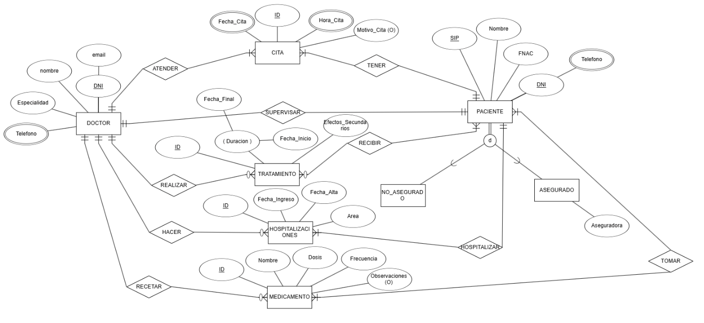

##  Repositorios 
Aquí tienes otros repositorios:
- [Base de Datos](https://github.com/Proyecto1k2024Grupo6/Base-de-datos) 
- [Modelo de clases UML](https://github.com/Proyecto1k2024Grupo6/Modelo-de-Clases-UML) 
- [Modelo de clases en Java](https://github.com/Proyecto1k2024Grupo6/Modelo-de-Clases-en-JAVA) 
- [XML y Jason a Java](https://github.com/Proyecto1k2024Grupo6/XML-y-Jason-a-Java)

## Usuario y Contraseña de la Base de Datos
Usuario:admin

Contraseña:admin1234

URL:databaseproyecto.cakrctirtenk.us-east-1.rds.amazonaws.com

Puerto:3306

## Repartición del Trabajo

Cada miembro del equipo se encargará de una parte específica del proyecto. 

###  **Asignación de Tareas**
La división del trabajo quedará reflejada en el documento principal del proyecto. Un ejemplo de cómo se puede organizar:

- **Liam Rodriguez**: Tablas → `Doctor`, `Cita`
- **Alejandro Rodriguez**: Tablas → `Paciente`, `Asegurado`
- **Sergio Zambrana**: Tablas → `Tratamiento`, `Recibir`, `Supervisar`
- **Alejandro Exposito**: Tablas → `Hospitalizaciones`, `Hospitalizar`
- **Todos**: Tablas más complejas → `Medicamento`, `Recetar`, `Tomar`  

